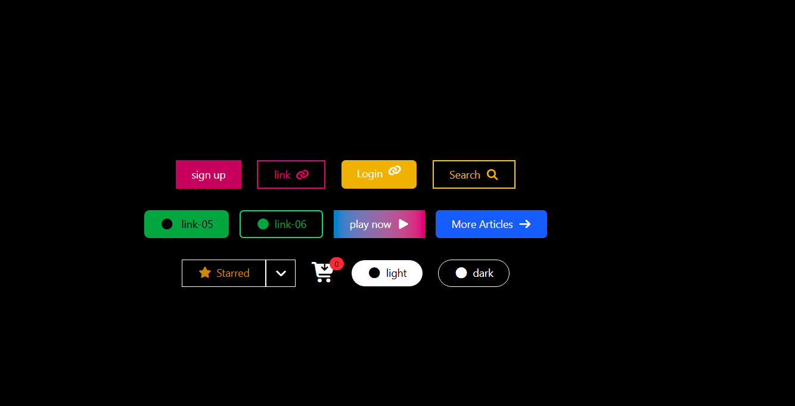

# Tailwind CSS Button Components

A collection of modern, responsive, and customizable button components built using **Tailwind CSS** and **Font Awesome icons**. This project demonstrates different button styles including gradient buttons, icon buttons, outlined buttons, grouped buttons, and notification badges.

---

## 📌 Features

* 🎨 Multiple button styles (solid, outline, gradient)
* ⭐ Icon support using Font Awesome
* 📱 Responsive layout with Tailwind Flex utilities
* 🔔 Notification badge example
* 🌗 Light and Dark style buttons
* 🧩 Button group with dropdown icon
* ⚡ Hover effects and transitions

---

## 🛠️ Technologies Used

* **HTML5**
* **Tailwind CSS (CDN version)**
* **Font Awesome Icons**


[link](https://elbineldhose007.github.io/tailwind-css-buttons/)


---

## 📂 Project Structure

```
project-folder
│
├── index.html
└── README.md
```

---

## 🚀 Getting Started

### 1. Clone the repository

```bash
git clone https://github.com/your-username/tailwind-buttons.git
```

### 2. Open the project

Simply open the `index.html` file in your browser.

No build tools or installations are required since the project uses **Tailwind CDN**.

---

## 🎯 Button Types Included

### 1. Primary Button

A simple filled button with hover color change.

### 2. Outline Button

Border styled button that fills on hover.

### 3. Icon Button

Buttons with Font Awesome icons.

### 4. Gradient Button

Stylish gradient background with hover effect.

### 5. Rounded Button

Buttons with rounded corners for modern UI.

### 6. Button Group

A grouped button with a dropdown indicator.

### 7. Cart Icon with Badge

An example of a shopping cart icon with a notification counter.

### 8. Theme Buttons

Light and Dark mode style buttons.

---

## 📸 UI Preview

The interface displays:

* Signup button
* Login button
* Search button
* Gradient play button
* Article navigation button
* Starred dropdown button
* Cart notification badge
* Light / Dark toggle buttons

All elements are centered using Tailwind's flex utilities.

---

## 💡 Learning Purpose

This project is useful for beginners learning:

* Tailwind CSS utility classes
* Responsive layouts
* Icon integration
* Modern UI button design

---

## 🔧 Customization

You can easily modify the buttons by changing Tailwind classes such as:

```
bg-color
hover:bg-color
rounded
border
flex
gap
```

Example:

```html
<button class="px-6 py-2 bg-blue-500 hover:bg-blue-700 text-white rounded-lg">
Click Me
</button>
```

---

## 📄 License

This project is open-source and free to use for learning and personal projects.

---

## 👨‍💻 Author

Developed for practicing **Tailwind CSS UI components**.

Feel free to improve and expand the button collection.

